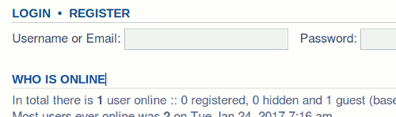
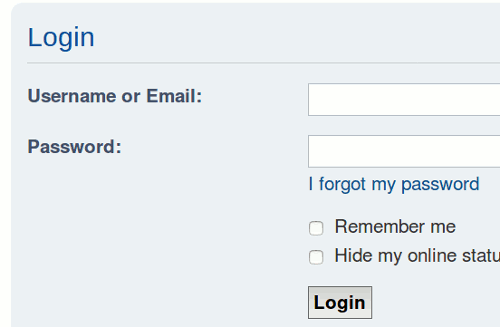
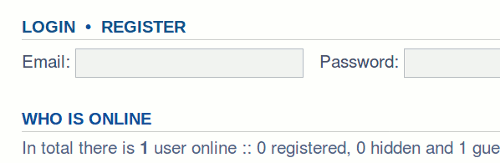
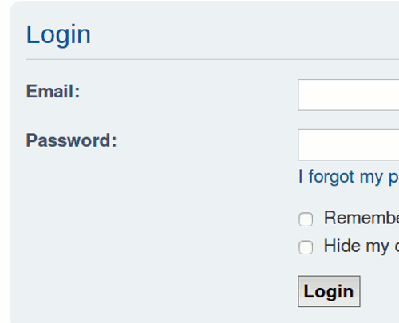

# phpBB Extension - marttiphpbb Email Login

[Topic on phpBB.com](https://www.phpbb.com/community/viewtopic.php?f=456&t=2474801)

This phpBB extension provides 2 authentication providers, which are extended from the basic database provider:

* Db_email: To login with email and password.
* Db_username_or_email: To login with username or email and password.

Only users with a unique email address in the database will be able to login. It is recommanded to check beforehand if all email addresses are unique. When you left the configuration option "Allow email address re-use" in the ACP (General > Board configuration > User registration settings) to the default "false" in your board, this will be the case.

The provider Db_username_or_email checks first if the input is in the form of a valid email address. If that is the case, the user is identified by the email address.

Access to the ACP remains with username and password combination.

## Requirements

* phpBB 3.2.x
* PHP 7+

## To do

Add console command to check for uniqueness of email addresses.

## Quick Install

You can install this on the latest release of phpBB 3.2 by following the steps below:

* Create `marttiphpbb/emaillogin` in the `ext` directory.
* Download and unpack the repository into `ext/marttiphpbb/emaillogin`
* Enable `Email Login` in the ACP at `Customise -> Manage extensions`.
* Chose one of the providers Db_email or Db_username_or_email in the ACP. (General Client Communication > Authenication)

## Uninstall

* Disable `Email Login` in the ACP at `Customise -> Extension Management -> Extensions`.
* To permanently uninstall, click `Delete Data`. Optionally delete the `/ext/marttiphpbb/emaillogin` directory.

## Support

* Report bugs and other issues to the [Issue Tracker](https://github.com/marttiphpbb/phpbb-ext-emaillogin/issues).

## License

[GPL-2.0](license.txt)

## Screenshots

### Username or email login (Authentication provider Db_username_or_email)

### Email login (Authentication provider Db_email)

